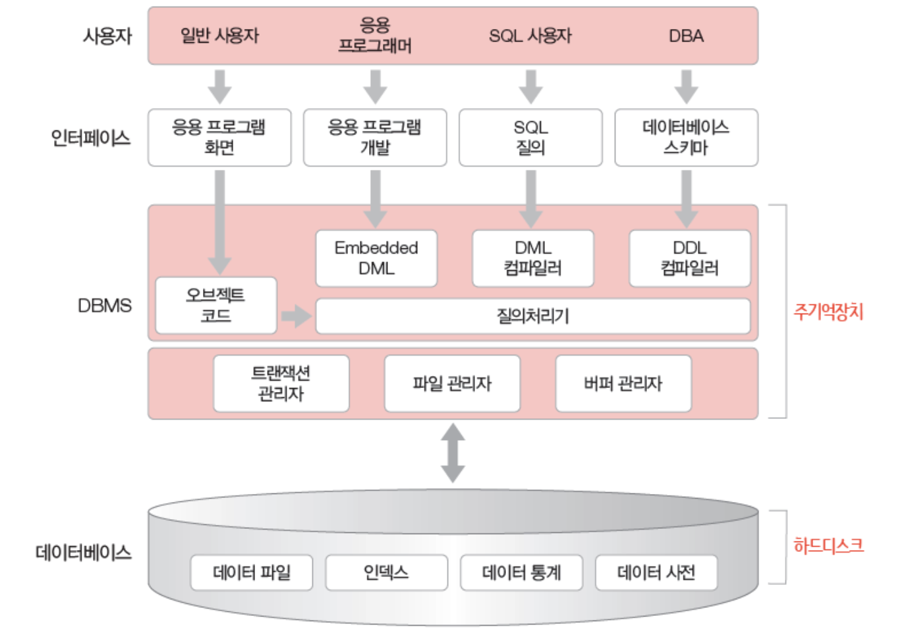
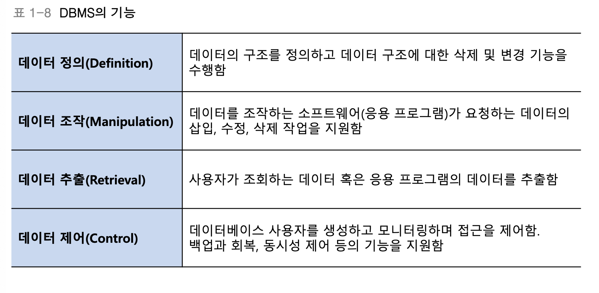
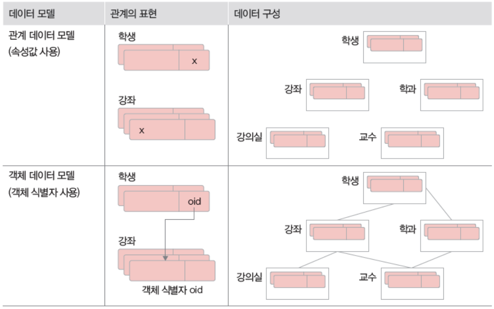

# Database
조직에 필요한 정보를 얻기 위해 논리적으로 연관된 데이터를 모아 구조적으로 통합해놓은 것

## 데이터베이스의 개념
1. 통합된 데이터
    - 데이터 중복 최소화 -> 중복으로 인한 데이터 불일치 현상 제거

2. 저장된 데이터
    - 컴퓨터 저장장치에 저장된 데이터

3. 운영 데이터
    - 업무를 위한 검색 등을 목적으로 저장된 데이터

4. 공용 데이터
    - 공동으로 사용되는 데이터

## 데이터베이스 시스템의 구성
- 데이터베이스 언어
- 데이터베이스 사용자
- DBMS
- 데이터 모델
- 데이터베이스의 개념적 구조

### 데이터베이스 언어
chap01에선 간단한 질의 명령어만 다룬다.
- SELECT: Table 내의 어떤 속성을 가지고 올 것인지
- FROM: 어떤 Table에서 가지고 올 것인지
- WHERE: 어떤 값을 가지고 있는 속성을 가지고 올 것인지

### DBMS

### 데이터 모델
- 개념
    - 데이터베이스 시스템에서 데이터를 저장하는 이론적인 방법
    - 데이터가 어떻게 구조화되어 저장되는지 결정
    - 관계 데이터 모델을 가장 많이 사용

- 종류
    - 계층 데이터 모델
    - 네트워크 데이터 모델
    - 객체 데이터 모델
    - 관계 데이터 모델

 

### 데이터베이스의 개념적 구조
- 3단계 데이터베이스 구조

- 외부 스키마
    - 전체 데이터베이스 중 하나의 논리적인 부분을 의미
    - 여러 개의 외부 스키마가 있을 수 있고 서브 스키마라고도 하며, 뷰(view)의 개념

- 개념 스키마
    - 전체 데이터베이스의 정의를 의미
    - 통합 조직별로 하나만 존재하며 DBA가 관리
    - 하나의 데이터베이스에는 하나의 개념 스키마가 있음

- 내부 스키마
    - 물리적 저장장치에 데이터베이스가 실제로 저장되는 방법의 표현
    - 내부 스키마는 하나
    - 인덱스, 데이터 레코드의 배치 방법, 데이터 압축 등의 사항이 포함

- 외부/개념 매핑
    - 외부 스키마의 데이터가 개념 스키마의 어느 부분에 해당되는지 대응

- 개념/내부 매핑
    - 개념 스키마의 데이터가 내부 스키마의 물리적 장치 어디에 어떤 방법으로 저장되는지 대응시킴

- 데이터 독립성
    - 하위 단계를 추상화해서 상위 단계에 그 세부사항을 숨김으로써 한 단계 내의 변경에 대해 다른 관계와의 상호 간섭이 없도록 하는 것
    - 논리적 데이터 독립성과 물리적 데이터 독립성으로 나뉨

- 논리적 데이터 독립성
    - 외부 단계와 개념 단계 사이의 독립성
    - 개념 스키마가 변경되어도 외부 영향 x
    - 논리적 구조가 변경되어도 응용프로그램에는 영향 x

- 물리적 데이터 독립성
    - 개념 단계와 내부 단계 사이의 독립성
    - 내부 스키마가 변경되어도 개념 스키마에 영향 x