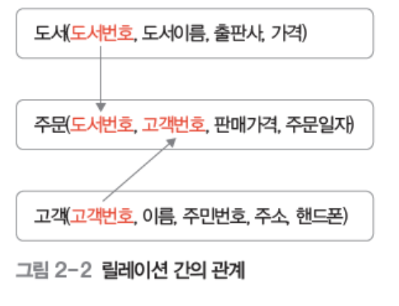
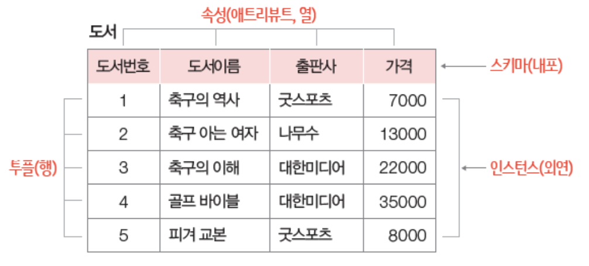
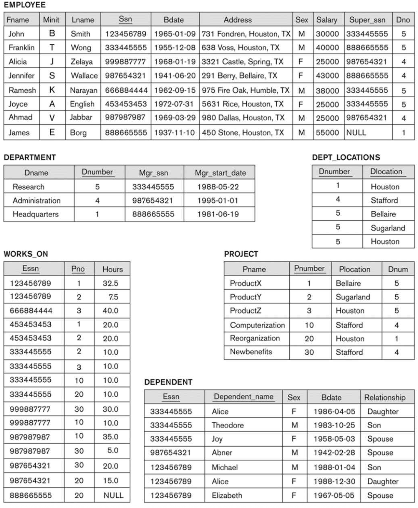
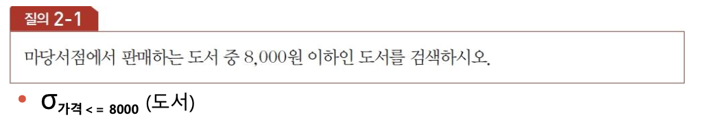

# 관계 데이터 모델

## 관계 데이터 모델의 개념

### 관계
- 릴레이션 내의 관계와 릴레이션 간의 관계가 있다.
- 릴레이션 내의 관계: 릴레이션 안에 있는 데이터들의 집합으로 표현
- 릴레이션 간의 관계: 릴레이션을 식별 가능한 값을 이용해 표현

 

[릴레이션 간의 관계 예시]

### 릴레이션 스키마와 인스턴스
- 릴레이션
    - 행과 열로 이루어진 테이블
    - 스키마와 인스턴스로 이루어짐

- 릴레이션 스키마
    - 속성(attribute): 릴레이션 스키마의 열(row)
    - 튜플(tuple): 릴레이션의 행(column)
    - 도메인(domain): 속성이 가질 수 있는 값의 집합
    - 차수(degree): 속성의 개수
    - 카디널리티(cardinality): 튜플의 수

- 특징
    - 속성은 단일값을 가짐
    - 속성은 서로 다른 이름을 가짐
    - 한 속성의 값은 모드 같은 도메인 값을 가짐
    - 속성의 순서는 상관 x
    - 튜플의 순서는 상관 x
    - 중복된 튜플은 허용 x

### 관계 데이터 모델
- 데이터를 2차원 테이블 형태인 릴레이션으로 표현
- 릴레이션에 대한 제약조건과 관계 연산을 위한 관계대수 정의

- 관계 데이터베이스 시스템
    - 관계 데이터 모델을 컴퓨터 시스템에 구현한 것
    - 관계 데이터 모델에 기초하여 SQL을 기반으로 구변

## 무결성 제약조건

### 키
릴레이션에서 특정 튜플을 식별할 때 사용하는 속성 혹은 속성의 집합
    
- 슈퍼키(super key)
    - 튜플을 유일하게 식별할 수 있는 하나의 속성 혹은 속성의 집합

- 후보키(candidate key)
    - 튜플을 유일하게 식별할 수 있는 속성의 최소 집합

- 기본키(primary key)
    - 여러 후보키 중 하나를 선정하여 대표로 삼는 키
    - 기본키는 속성 밑에 밑줄을 그어 표시

- 대리키(surrogate key, artificial key)
    - 기본키가 보안을 필요로 하거나, 마땅한 기본키가 없을 때 가상의 속성을 만들어 기본키로 삼는 경우

- 외래키(foreign key)
    - 다른 릴레이션의 기본키를 참조하는 속성
    - 참조하는 테이블은 외래키를 통해 참조되는 테이블의 기본키를 참조
    - 각 테이블마다 속성의 이름이 달라도 됨

[데이터베이스 구조 예제]

- EMPLOYEE 테이블의 후보키: {Ssn}
	- Dno는 DEPARTMENT table의 기본키의 값 중 하나가 될 수 있다.  
	-> Dno는 DEPARTMENT 참조하는 foreign key 
	- Super_ssn도 EMPLOYEE table의 Ssn 참조  
	-> foreign key는 같은 테이블을 참조할 수 있음.

- DEPARTMENT 테이블의 후보키: {Dnumber}, {Dname}
	- Mgr_ssn으로 부서장의 정보를 알 수 있음  
	-> Mgr_ssn은 EMPLOYEE table을 참조한 foreign key

- DEPT_LOCATIONS 테이블의 후보키: {Dnumber, Dlocation}
	- DEPARTMENT table의 Dnumber attribute를 참조
	- foreign key

- PROJECT 테이블의 후보키: {Pnumber}, {Pname}

- WORKS_ON 테이블의 후보키: {Essn, Pno} -> composite key
	- Essn으로 사원의 정보, Pno로 어떤 프로젝트에 참여했는지 알 수 있음  
	-> Essn은 EMPLOYEE table을 참조한 foreign key  
	-> Pno는 PROJECT table을 참조한 foreign key

- DEPENDENT 테이블의 후보키: {Essn, Dependenet_name} -> composite key

### 무결성 제약조건
- 데이터 무결성
    - 데이터베이스에 저장된 데이터의 일관성과 정확성을 지키는 것
    - 튜플의 삽입/삭제/수정 시 데이터의 제약조건 준수 여부를 확인

     

- 무결성 제약조건(integrity constraints)
    - 도메인 무결성 제약조건
        - 제약대상: 속성
        - 같은 용어: 도메인 제약
        - 해당되는 키: x
        - NULL 값: 허용
        - 릴레이션 내 제약조건 개수: 속성 개수와 동일
        - 기타: 튜플 삽입/수정 시 제약사항 우선 확인
        
         

    - 개체 무결성 제약조건
        - 제약대상: 튜플
        - 같은 용어: 기본키 제약
        - 해당되는 키: 기본키
        - NULL 값: 불허
        - 릴레이션 내 제약조건 개수: 1개
        - 기타: 튜플 삽입/수정 시 제약사항 우선 확인
        - 삭제할 땐 특별한 확인 불필요

        **[ex) Student relation]**
 		|  학번  |	이름   |  학과코드  |
 		|:-----:|:-------:|:-------:|
 		|  501  |  박지성   |  1001   |

        => (501, 남슬찬, 1001) -> 삽입 거부; 학번 겹침  
     	=> (NULL, 남슬찬, 1001) -> 삽입 거부; NULL 값 불허  

         

    - 참조 무결성 제약조건
        - 제약대상: 속성과 튜플
        - 같은 용어: 외래키 제약
        - 해당되는 키: 외래키 (참조되는 테이블의 기본키에 존재하는 값만 가질 수 있음)
            - 참조되는 릴레이션이 먼저 만들어져야 함(참조되는 릴레이션 = 부모 릴레이션)
        - NULL 값: 허용
        - 릴레이션 내 제약조건 개수: 0 ~ 여러 개
        - 기타: 튜플 삽입/수정 시 제약사항 우선 확인  
               부모 릴레이션의 튜플 수정/삭제 시 제약사항 우선 확인  
            -> 참조 무결성 깨질 수 있음

     

    **[ex) 학생, 학과 릴레이션]**

    [학생 (자식 릴레이션)]
	|  학번  |  이름  |  학과코드  |
    |:-----:|:-------:|:-------:|
	|  501  | 박지성 |   1001   |
	|  ...  | ... |   ...   |

	[학과 (부모 릴레이션)]
	|  학과코드  | 학과명 |
    |:-----:|:-------:|
	|  1001  | 컴퓨터학과| 
	|  2001  | 체육학과 |
    |  ...  | ... | 

    =>  
	(503, 김일수, 3001) -> 삽입 거부; 학과코드 없음  
    (504, 김이수, NULL) -> 삽입 가능  
	(507, 김삼수, 2001) -> 삽입 가능  
	(NULL, 김사수, 1001) -> 삽입 불가; 학생 릴레이션의 기본키라 NULL 불가  
	(502, 김오수, 1001) -> 삽입 불가; 학번 겹침  

	(3001, 컴퓨터) -> 삽입 가능  
	(NULL, 소프) -> 삽입 불가; 학과 릴레이션의 기본키라 NULL 불가  
     

- 참조 무결성 제약조건의 옵션 (부모 릴레이션에서 튜플을 삭제할 경우)
	- RESTRICTED: 자식 릴레이션에서 참조하고 있으면 삭제 거부
	- CASCADE: 자식 릴레이션의 관련 튜플을 함께 삭제
	- DEFAULT: 자식 릴레이션의 관련 튜플을 미리 설정해둔 값으로 변경
	- NULL: 자식 릴레이션의 관련 튜플을 NULL값으로 설정 (허용한 경우)

## 관계대수

### 관계대수
- 관계대수의 개념
    - 릴레이션에서 원하는 결과를 얻기 위해, 대수같은 연산을 이용하여 질의하는 방법을 기술하는 언어

- 관계대수식

### 셀렉션과 프로젝션
- 셀렉션(selection): 릴레이션의 튜플을 추출하기 위한 연산

    