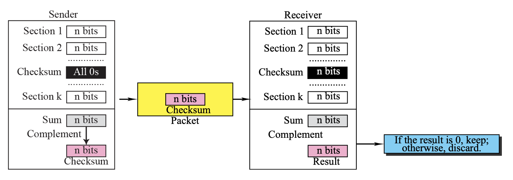
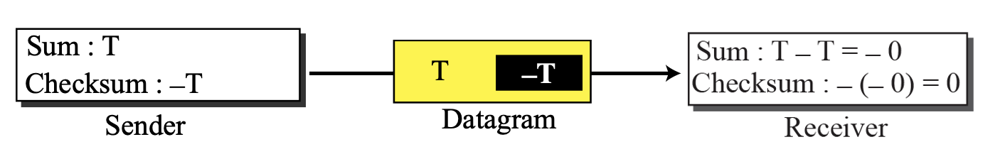
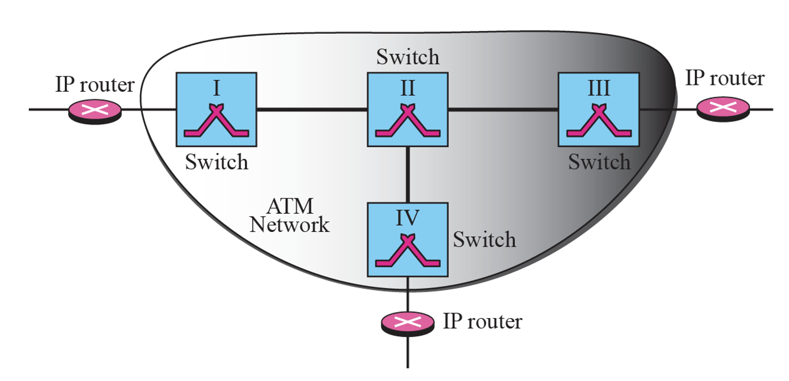
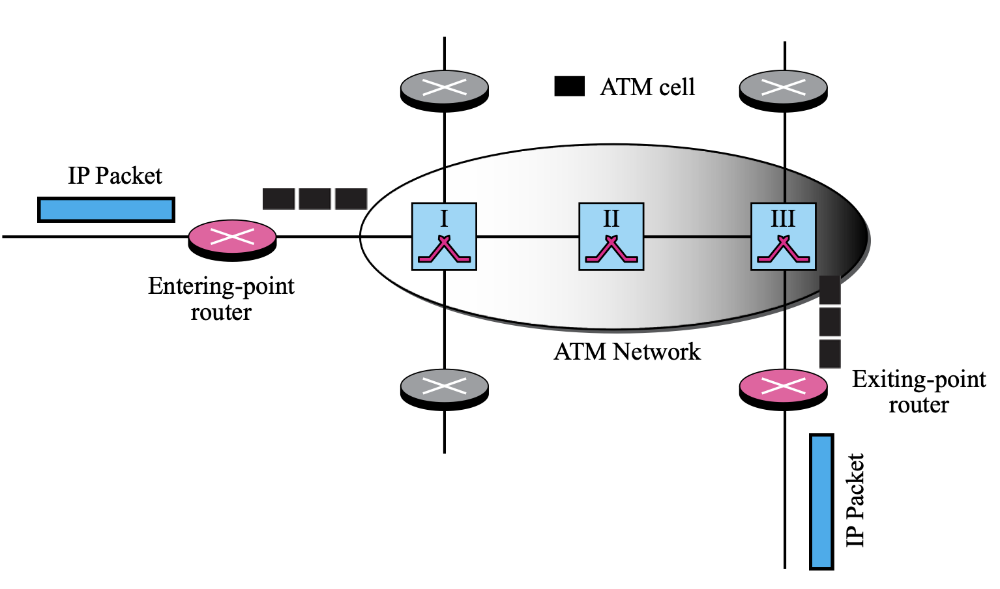
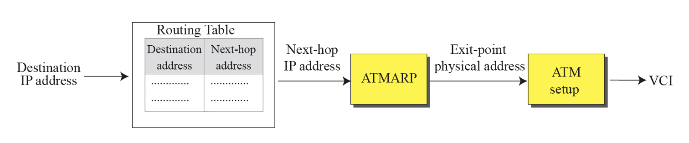
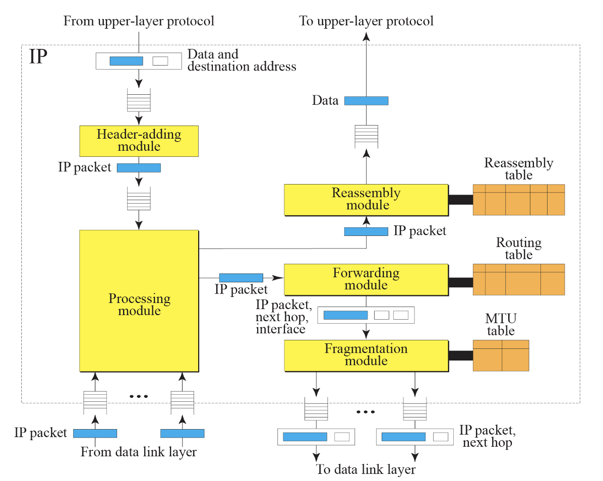
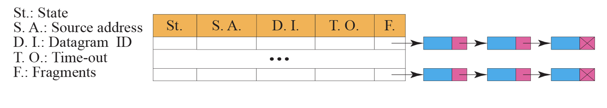

# TCP/IP
chap 07 (IPv4)

## Datagram
- 네트워크 계층에서 IP 프로토콜이 사용하는 패킷 단위

- IP datagram 구조

    

    1. VER (4bits)
        - IP version, IPv4이면 value = 4    

    2. HLEN (4bits)
        - 헤더 길이를 알려주는 필드
        - 최소 0101(=5) ~ 최대 1111(=15)
        - 헤더의 길이는 HLEN * 4

    3. Service type (8bits)

        
        
     

    4. Total length (16bits)
        - header + data 전체 길이

    5. Identification (16bits)
        - 단편화가 됐을 경우, 재조립을 위한 식별번호가 들어가있음 (몇 번째 fragment 인지)

    6. Flags (3bits)

          | X | D               | M              |
          |:-:|:---------------:|:--------------:|
          | - | Do not fragment | More fragments |

        - 3bit 크기로 이루어져있고, 제일 왼쪽 비트는 사용 안 함
        - D = 1인데 단편화가 필요한 상황이면 라우터가 패킷 버림
        - M = 1이면 뒤에 fragment가 더 있음
        - M = 0이면 마지막 fragment
    

    7. Fragmentation offset (13bits)
        - 단편화된 데이터를 재조립할 때 원래 데이터의 순서를 알 수 있게 해주는 값
        - 네트워크의 MTU에 따라 크기가 달라짐
        - MTU(Maximum Transmission Unit): 네트워크에서 한 번의 통신으로 전송할 수 있는 데이터 패킷의 최대 크기

            
            

    
    8. TTL(Time To Live) (8bits)
        - 홉마다(라우터를 지날 때마다) 1씩 감소, 0이 되면 폐기
    
    9. Protocol (8bits)
        - 상위 프로토콜 식별값이 들어감

            

    10. Header checksum (16bits)
        - 헤더만을 대상으로 오류 검사
        - 송신하려는 데이터를 n조각으로 나누고, 1의 보수를 취함
        - 데이터를 받은 쪽에서 데이터 조각을 모두 더히고 1의 보수를 다시 취했을 때, 0이 되어야 함
        - 0 안되면 버림

            
            

     

    11. Source address (32bits)
        - 발신자 IPv4 주소

    12. Destination address (32bits)
        - 수신자 IPv4 주소
    
    13. Options + padding (0 ~ 40bytes)
        - 주로 테스트나 디버깅 용도로 사용
        - Padding: 헤더를 4바이트 배수로 맞추기 위해 0 또는 NOP/EOL 활용

            
            

        - No operation (Type 0)
            - 특별한 기능 없이, 패딩이나 옵션 사이의 구분용
        
        - End of option (Type 1)
            - 옵션이 여기서 끝났음을 알림

        - Record-route (Type 7)
            - 패킷이 거쳐가는 라우터의 IP 주소를 차례대로 기록
        
                

             

        - Strict-source-route (Type 137)
            - 송신자가 정한 경로만을 따라가도록 강제함

                

             
            
        - Loose-source-route (Type 131)
            - 송신자가 정한 경로는 따라가되, 추가로 들려도 됨
            - 단 송신자가 정한 경로는 무조건 거쳐가야 함

                

             

        - Time-stamp (Type 68)
            - 라우터가 패킷을 다음 홉으로 전달할 때 현재 시간값을 찍고 보냄
            - 패킷을 받은 라우터가 (현재 시간 - timestamp value) 계산을 통해 걸린 시간 측정

                

             

## IP over ATM
- IP 패킷을 ATM 망 위에서 전달하기 위한 기술
- IP는 가변 길이 패킷을 쓰는데, ATM은 53바이트 고정 셀을 씀 (head 5byte, data 48byte)  
-> IP 데이터그램은 여러 개의 ATM 셀로 쪼개져 전송

- ATM은 자체적인 물리 주소 체계를 가지고 있음  
-> IP 주소 ↔ ATM 물리 주소 간의 매핑이 필요하고, 이를 담당하는 프로토콜이 **ATMARP (ATM Address Resolution Protocol)**

- IP가 ATM 위에서 동작할 때 사용하는 적응 계층은 **AAL5 (ATM Adaptation Layer 5)**
- AAL5는 가변 길이 데이터를 ATM 셀 단위로 분할/조립하는 기능을 제공

     

    

    

    

    - ATM ARP Request를 보내도, switch끼리 연결된 point to point 방식이라 broadcast가 불가능한데, 주소를 아는 방법이 따로 있음  
        -> ATM 주소가 저장되어 있는 서버가 네트워크 안에 따로 존재

    - Entering-point Router
        - IP 데이터그램을 받아서, ATM 네트워크로 보낼 준비를 함
        - IP 데이터그램을 AAL5를 통해 ATM 셀 여러 개로 쪼갬 (Segmentation)
        - 목적지 주소에 맞게 ATM 헤더를 붙여 ATM 네트워크에 전송

    - Exiting-point Router
        - ATM 네트워크에서 온 셀들을 다시 모아 원래 IP 데이터그램으로 복원
        - 즉, ATM 셀들을 재조립 (Reassembly) 해서 상위 계층(IP 계층)으로 전달

    - ATM 네트워크
        - ATM 스위치들은 단순히 셀 헤더만 보고 빠르게 스위칭할 뿐, IP 내용을 직접 보지 않음
        - 따라서 IP 데이터그램은 ATM 네트워크 안에서는 투명하게 전송됨

## Security
- 초기에 암호화 개념이 없었음
- 후에 등장한 게 IPSec

 

- IPSec
    - Encryption을 통한 Sniffing 방지
    - Integrity를 통한 Modification 방지
    - Authentication을 통한 Spoofing 방지

## IP Package

- Header-Adding Module
    - 상위 계층(TCP/UDP 등)에서 온 데이터를 받아 IP 헤더를 붙임
    - ex) 출발지/목적지 IP 주소, TTL, Protocol 번호, Checksum 계산

- Processing Module
    - 수신 측에서 IP 헤더를 확인하고, 유효성 검사(버전, 체크섬 등) 수행
    - 상위 계층으로 데이터를 전달할지, 폐기할지 결정

- Queues (입출력 큐)
    - 패킷을 임시 저장하는 버퍼

- Routing Table
    - 패킷을 어디로 보낼지 결정하기 위한 테이블
    - 목적지 주소를 보고, 다음 홉(next hop)과 인터페이스를 선택

- Forwarding Module
    - 라우터 역할을 할 때 사용하는 기능
    - 들어온 패킷을 다시 다른 인터페이스로 내보내는 처리 담당

- MTU Table
    - 각 인터페이스별로 허용하는 MTU 값 저장
    - 패킷 크기를 확인하고, 필요하다면 단편화(fragmentation) 수행

- Fragmentation Module
    - 패킷이 너무 크면 여러 조각으로 분할
    - Identification, Offset, M 비트 설정

- Reassembly Table & Reassembly Module
    - 도착한 조각들을 다시 원래의 IP 데이터그램으로 복원
    - Identification, Offset, M 비트를 사용해서 조립

 

- 송신: TCP/UDP 데이터 → Header-Adding Module → Routing 결정 → MTU 확인/단편화 → 출력 큐 → 네트워크 인터페이스로 전송

- 수신: 네트워크 인터페이스 → 입력 큐 → Processing Module(버전/체크섬/TTL 확인) → 재조립 → 상위 계층으로 전달