# TCP/IP
chap 07 (IPv4)

## Datagram
- 네트워크 계층에서 IP 프로토콜이 사용하는 패킷 단위

- IP datagram 구조

    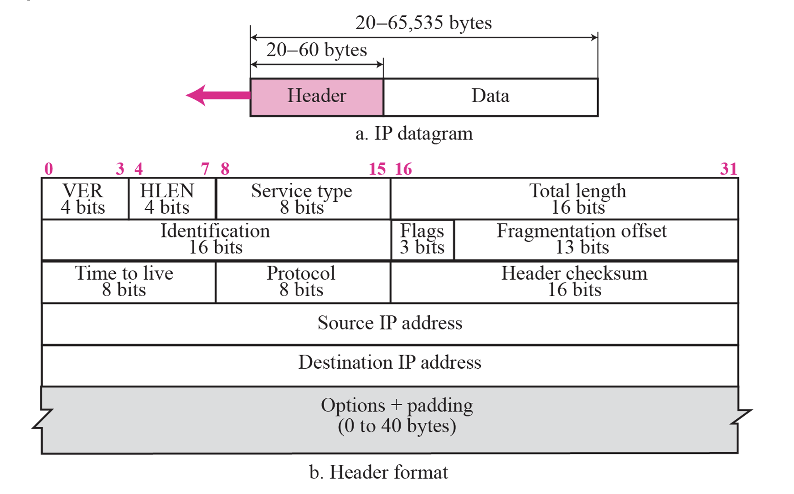

    1. VER (4bits)
        - IP version, IPv4이면 value = 4    

    2. HLEN (4bits)
        - 헤더 길이를 알려주는 필드
        - 최소 0101(=5) ~ 최대 1111(=15)
        - 헤더의 길이는 HLEN * 4

    3. Service type (8bits)

        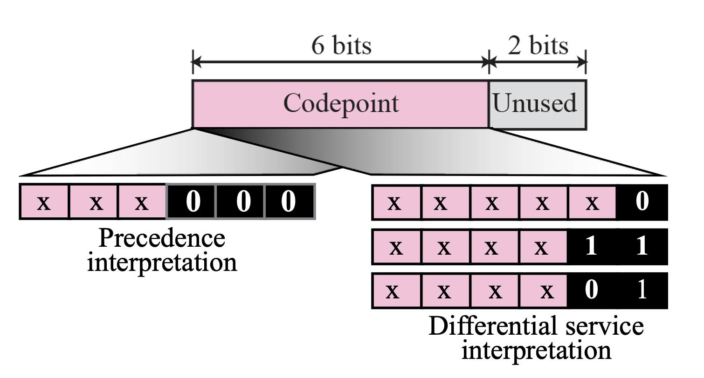
        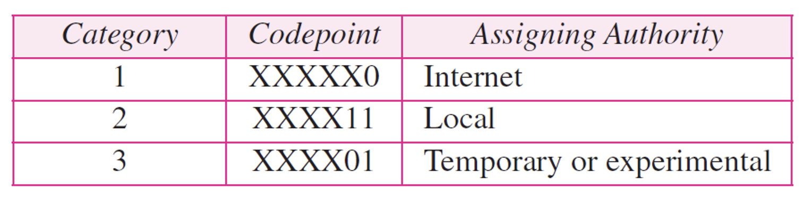
     

    4. Total length (16bits)
        - header + data 전체 길이

    5. Identification (16bits)
        - 단편화가 됐을 경우, 재조립을 위한 식별번호가 들어가있음 (몇 번째 fragment 인지)

    6. Flags (3bits)

          | X | D               | M              |
          |:-:|:---------------:|:--------------:|
          | - | Do not fragment | More fragments |

        - 3bit 크기로 이루어져있고, 제일 왼쪽 비트는 사용 안 함
        - D = 1인데 단편화가 필요한 상황이면 라우터가 패킷 버림
        - M = 1이면 뒤에 fragment가 더 있음
        - M = 0이면 마지막 fragment
    

    7. Fragmentation offset (13bits)
        - 단편화된 데이터를 재조립할 때 원래 데이터의 순서를 알 수 있게 해주는 값
        - 네트워크의 MTU에 따라 크기가 달라짐
        - MTU(Maximum Transmission Unit): 네트워크에서 한 번의 통신으로 전송할 수 있는 데이터 패킷의 최대 크기

            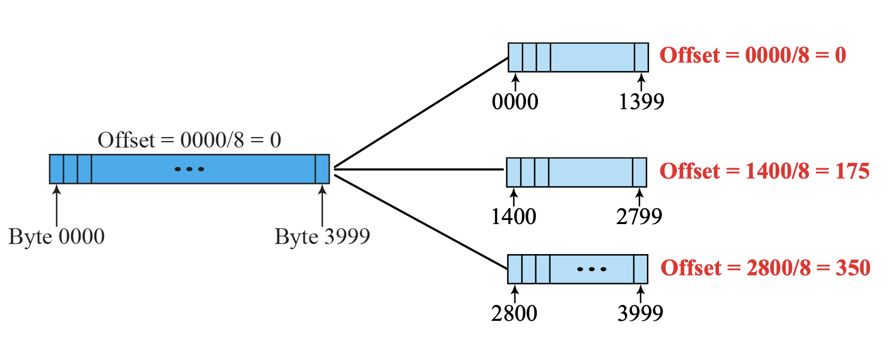
            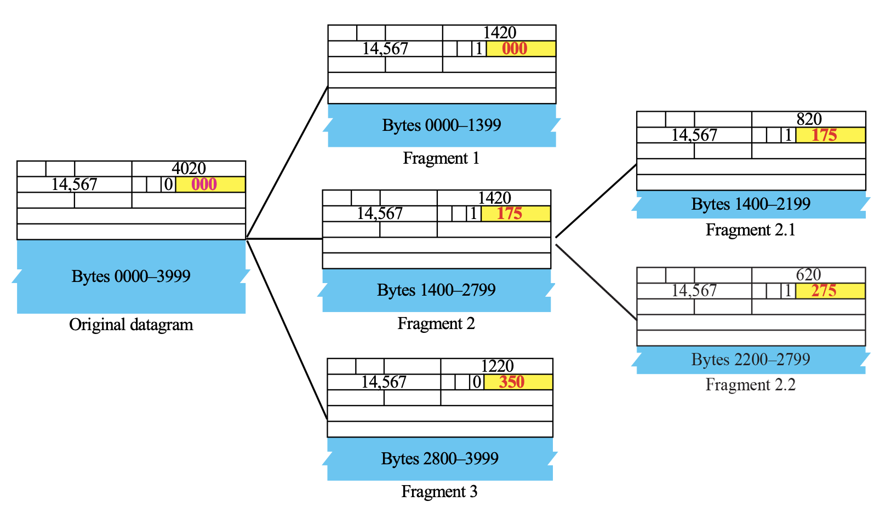

    
    8. TTL(Time To Live) (8bits)
        - 홉마다(라우터를 지날 때마다) 1씩 감소, 0이 되면 폐기
    
    9. Protocol (8bits)
        - 상위 프로토콜 식별값이 들어감

            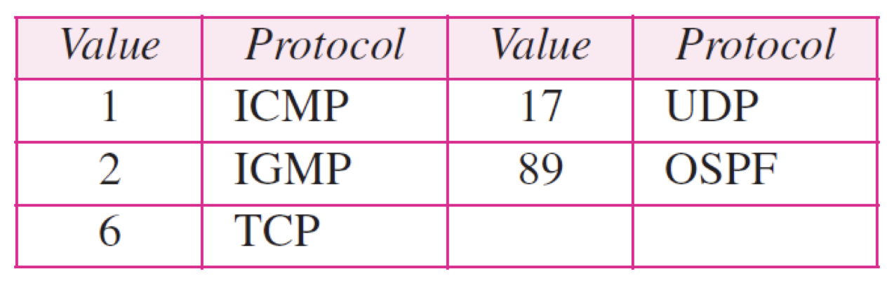

    10. Header checksum (16bits)
        - 헤더만을 대상으로 오류 검사

    11. Source address (32bits)
        - 발신자 IPv4 주소

    12. Destination address (32bits)
        - 수신자 IPv4 주소
    
    13. Options + padding (0 ~ 40bytes)
        - 주로 테스트나 디버깅 용도로 사용
        - Padding: 헤더를 4바이트 배수로 맞추기 위해 0 또는 NOP/EOL 활용

        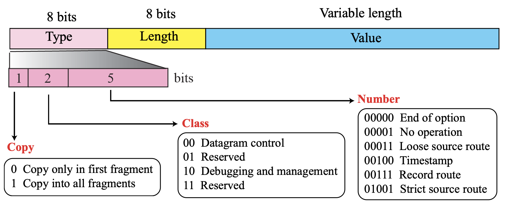
        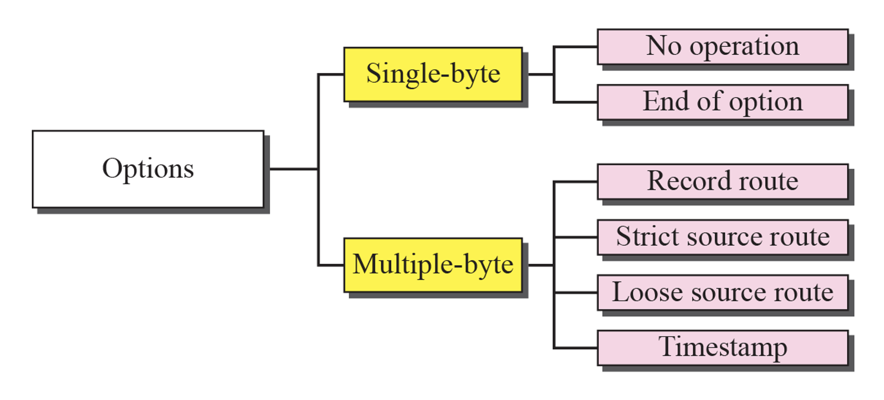

        - No operation (Type 0)
            - 특별한 기능 없이, 패딩이나 옵션 사이의 구분용
        
        - End of option (Type 1)
            - 옵션이 여기서 끝났음을 알림

        - Record-route (Type 7)
            - 패킷이 거쳐가는 라우터의 IP 주소를 차례대로 기록
        
            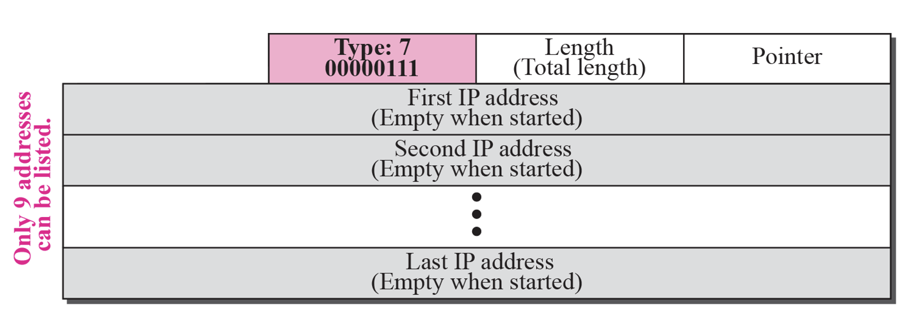

             

        - Strict-source-route (Type 137)
            - 송신자가 정한 경로만을 따라가도록 강제함

            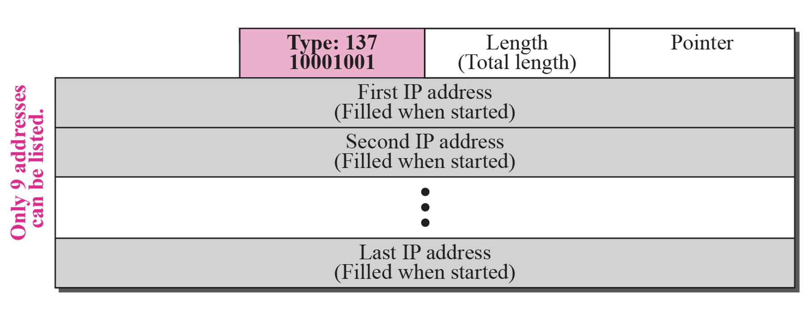

             
            
        - Loose-source-route (Type 131)
            - 송신자가 정한 경로는 따라가되, 추가로 들려도 됨
            - 단 송신자가 정한 경로는 무조건 거쳐가야 함

            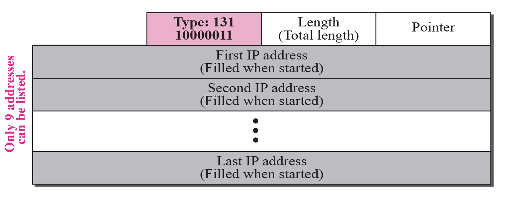

             

        - Time-stamp (Type 68)
            - 라우터가 패킷을 다음 홉으로 전달할 때 현재 시간값을 찍고 보냄
            - 패킷을 받은 라우터가 (현재 시간 - timestamp value) 계산을 통해 걸린 시간 측정

            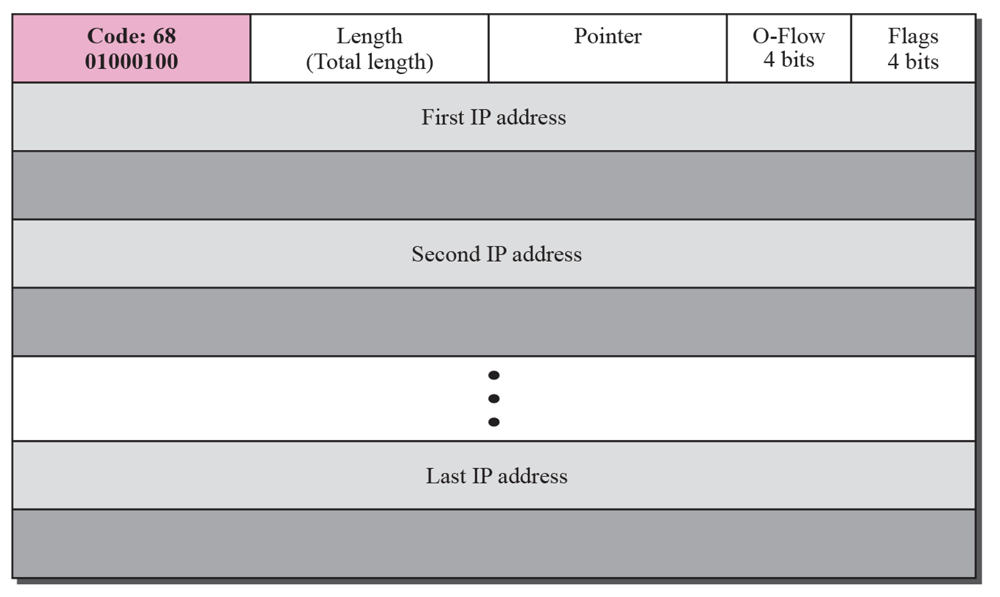

             