# TCP/IP

## Address Mapping
IP 통신을 할 때, 두 가지 주소 체계가 필요
1. 논리 주소 (Logical Address, IP Address)
2. 물리 주소 (Physical Address, MAC Address)
 

송신자가 IP Datagram을 보낼 때, 목적지 IP 주소를 알고 있어도 MAC 주소는 따로 알아야 전송 가능하기 때문에 IP -> MAC 매핑 과정이 필요함

### Mapping 방식
1. 정적 매핑(Static Mapping)
    - 관리자가 수동으로 IP -> MAC 설정
    - 간단하고 빠르지만, 확장성이 떨어지고 MAC주소가 바뀌면 일일이 수정 필요

2. 동적 매핑(Dynamic Mapping)
    - ARP(Address Resolution Protocol)을 이용해서 자동 매핑
    - 송신자가 모르는 MAC 주소를 ARP Request(broadcast)로 묻고, 대상이 Reply(unicast)로 응답
    - 자동화가 되어있고 유연하지만, ARP Spoofing에 취약할 수 있음

## ARP Protocol

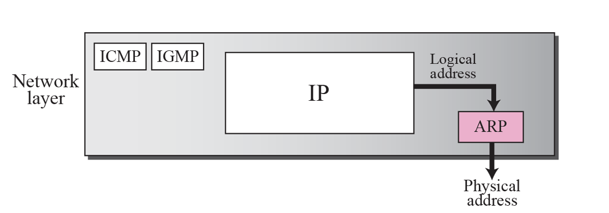

- TCP/IP 스택에서 ARP는 IP 계층(네트워크 계층)과 데이터링크 계층 사이에 위치
- IP 계층은 목적지 IP 주소를 알고 있음
- 하지만 패킷을 실제 네트워크에 내보내려면 프레임(데이터링크) 안에 목적지 **물리 주소(MAC)** 를 넣어야 함
- 이때 IP 계층이 ARP에게 IP 주소에 해당하는 MAC 주소 요청
- ARP가 MAC 주소를 찾아서 데이터링크 계층에 넘겨줌

 

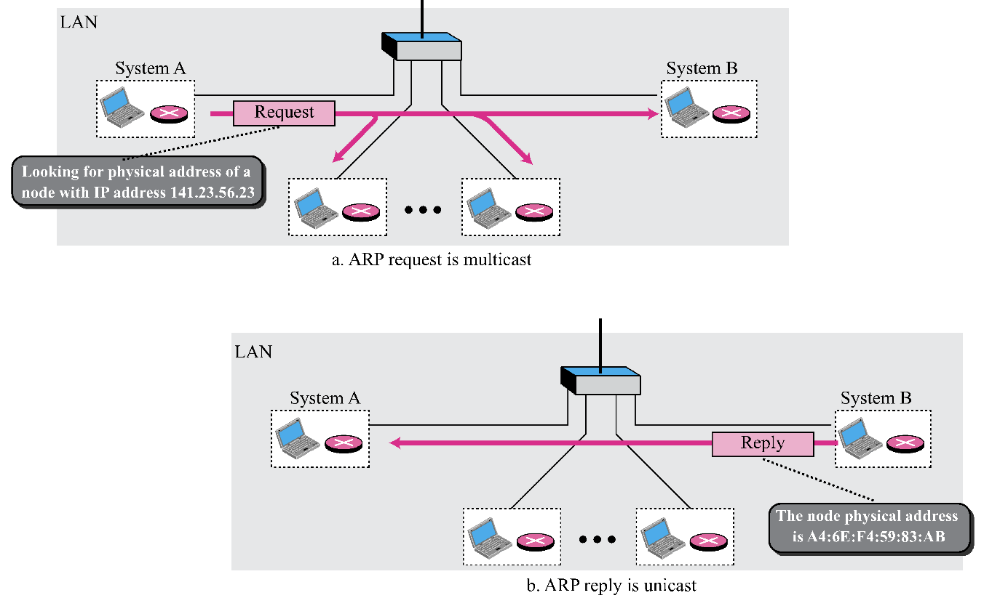

- 송신자(host A)
    - IP 데이터그램을 만들고, 목적지 IP가 192.168.1.20
    - 이 IP에 해당하는 MAC 주소를 모름 → ARP Request 생성

- ARP Request (Broadcast)
    - 송신자가 "192.168.1.20의 MAC 주소 알려줘" 라고 broadcast 전송

- 목적지(host B)
    - 자기 IP가 192.168.1.20임을 확인
    - 자신의 MAC 주소 08:00:27:4A:1B:3C를 담은 ARP Reply를 unicast로 송신자에게 응답

- 송신자(host A)
    - 응답받은 MAC 주소를 ARP Cache Table에 저장
    - 데이터링크 계층 프레임에 목적지 MAC을 넣고 정상적으로 데이터 전송

 

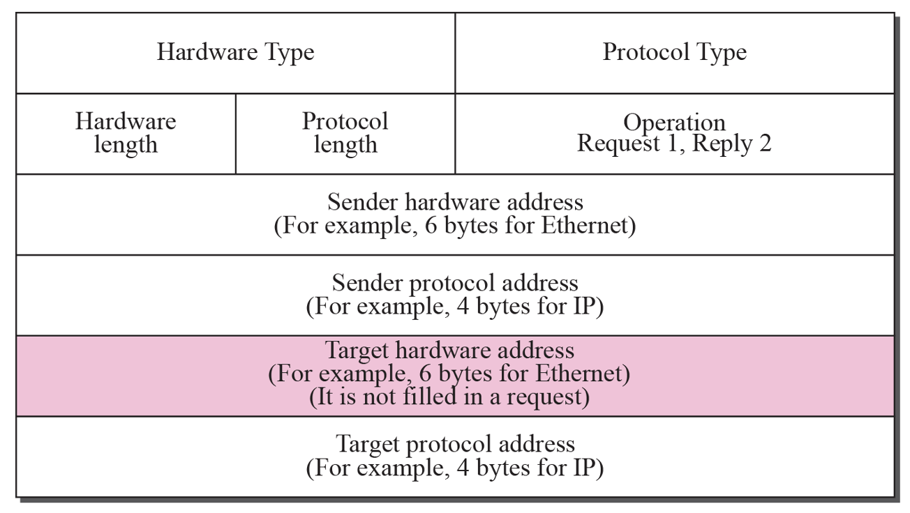

1. Hardware Type (HTYPE, 16bit)
    - 어떤 데이터링크 계층 주소를 쓰는지 정의 (Ethernet = 1)

2. Protocol Type (PTYPE, 16bit)
    - 어떤 네트워크 계층 주소를 쓰는지 정의 (IPv4 = 0x0800)

3. Hardware Length (HLEN, 8bit)
    - 물리 주소 길이 (MAC = 6바이트)

4. Protocol Length (PLEN, 8bit)
    - 논리 주소 길이 (IPv4 = 4바이트)

5. Operation (16bit)
    - ARP Request = 1
    - ARP Reply = 2

6. Sender Hardware Address (SHA)
    - 송신자 MAC 주소

7. Sender Protocol Address (SPA)
    - 송신자 IP 주소

8. Target Hardware Address (THA)
    - 목적지 MAC 주소 (요청 시 미정 → 0으로 채움)

9. Target Protocol Address (TPA)
    - 목적지 IP 주소

 

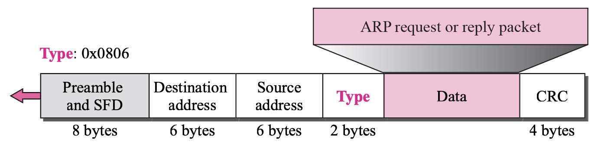

- ARP는 네트워크 계층(IP)을 거치지 않고, 데이터링크 계층(Ethernet)에서 바로 동작
- IP 헤더가 없고, Ethernet 프레임의 Payload 부분에 ARP 패킷이 그대로 들어감
- Destination MAC: ARP Request → FF:FF:FF:FF:FF:FF (브로드캐스트) | ARP Reply → 응답할 호스트의 실제 MAC (유니캐스트)
- Source MAC: 요청을 보낸 송신자의 MAC
- Type 필드: Ethernet 프레임의 Type 값이 0x0806이면 ARP라는 의미 (0x0800이면 IPv4, 0x86DD면 IPv6)

 

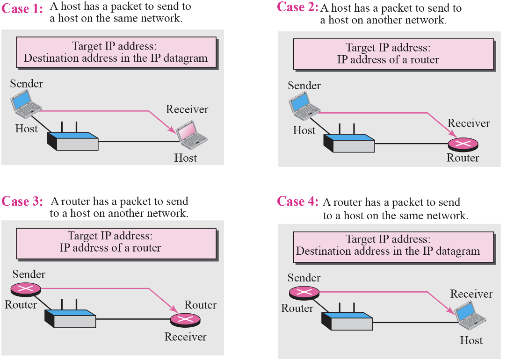

- <h3>Case 1. Host → Host (같은 네트워크 안의 두 호스트)</h3>

    - Host A가 같은 LAN 안의 Host B에게 데이터 보내려 함
    - A는 B의 IP 주소만 알고 있고, B의 MAC 주소는 모름
    - ARP Request(broadcast) → B가 자기 MAC 주소 담아서 Reply(unicast)
    - 가장 일반적인 ARP 동작 방식

- <h3>Case 2. Host → Router (게이트웨이로 보낼 때) </h3>

    - Host A가 다른 네트워크(서브넷)의 Host B와 통신 시도
    - A는 B의 IP를 알고 있지만, 직접 MAC 주소를 찾을 수는 없음 (브로드캐스트는 LAN 범위 한정)
    - 게이트웨이 라우터가 중계해야 하므로, A는 B가 아니라 Router의 MAC 주소를 알아야 함
    - 따라서 Host A는 Router IP를 대상으로 ARP 수행 → Router MAC 주소 획득 → 프레임을 Router에 전달

- <h3>Case 3. Router → Host (라우터가 최종 목적지 호스트로 보낼 때)</h3>

    - Router가 패킷을 받아서 같은 LAN 안의 Host B로 최종 전달해야 하는 경우
    - Router는 B의 IP는 알고 있으나, MAC 주소는 모를 수 있음
    - Router가 Host B를 대상으로 ARP 수행 → B가 MAC 주소로 응답
    - 이후 Router는 그 MAC 주소를 넣어 프레임 전달

- <h3>Case 4. Router → Router (서로 연결된 라우터 사이)</h3>

    - 두 라우터가 같은 네트워크 세그먼트로 연결되어 있을 때, 한 라우터가 다른 라우터로 IP 패킷을 전달해야 하는 경우
    - 라우터도 똑같이 상대 라우터의 IP만 알고 있을 수 있으므로, ARP로 MAC 주소를 알아내야 함

  

### Proxy ARP
- 원래 ARP는 같은 네트워크 안에서만 동작 (A가 B의 IP 주소를 알고 있어도, B가 다른 네트워크(서브넷)에 있으면 직접 ARP로 MAC을 알아낼 수 없음)

- 이때, 라우터가 대신 해당 IP 받아주는 방식이 Proxy ARP

    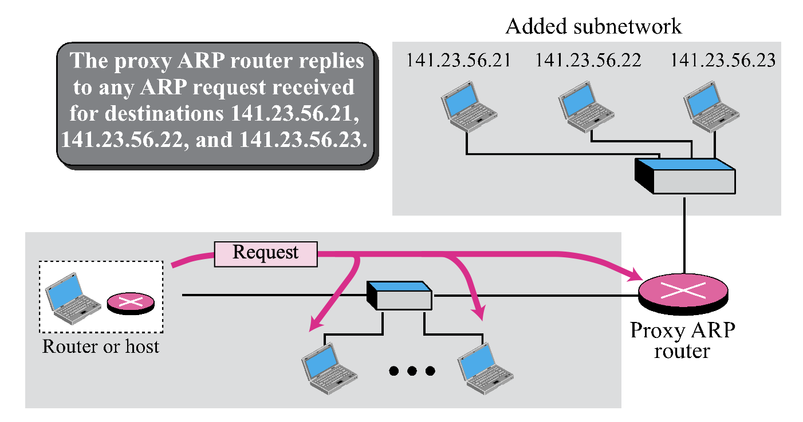

 

## ATM ARP
Ethernet에서는 브로드캐스트가 가능해서 ARP Request 뿌리면 통신하려는 장비의 MAC 주소를 알 수 있지만, ATM 네트워크는 Point to Point 방식이라 브로드캐스트가 불가능하다.   
따라서 특정 IP를 가진 장비의 MAC 주소를 저장할 중앙 서버가 필요한데, 이를 ATMARP Server라고 한다.
 

### 동작 방식

1. PVC (Permanent Virtual Circuit) 환경
- 라우터와 ATMARP 서버 사이에 영구 가상회선(PVC)이 이미 설정돼 있음
- 호스트가 매핑을 원할 때, ATMARP 서버에 요청 → 서버가 응답으로 ATM 주소 알려줌
- Inverse Request/Reply 메시지를 이용해 "ATM 주소 ↔ IP 주소" 바인딩 가능

2. SVC (Switched Virtual Circuit) 환경
- 동적으로 가상회선을 설정
- 호스트가 ATMARP 서버에 Request를 보내서 매핑 요청
- 서버는 응답(Reply)으로 IP ↔ ATM 주소를 알려줌
- 동시에 서버는 자신의 매핑 테이블을 갱신(Inverse ARP 이용)

### ATMARP Packet

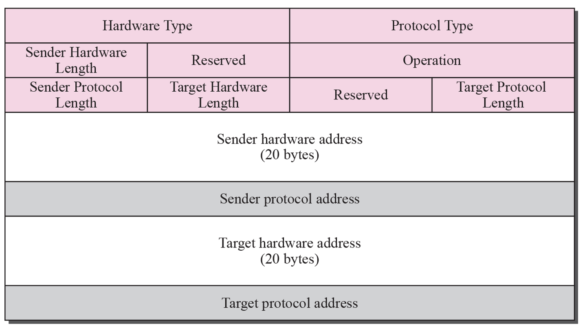

- Ethernet ARP와 구조 유사하지만, ATM 주소 필드가 더 김
- PVC/SVC 상황에 따라 Request / Reply / Inverse Request / Inverse Reply 메시지를 사용

### PVC

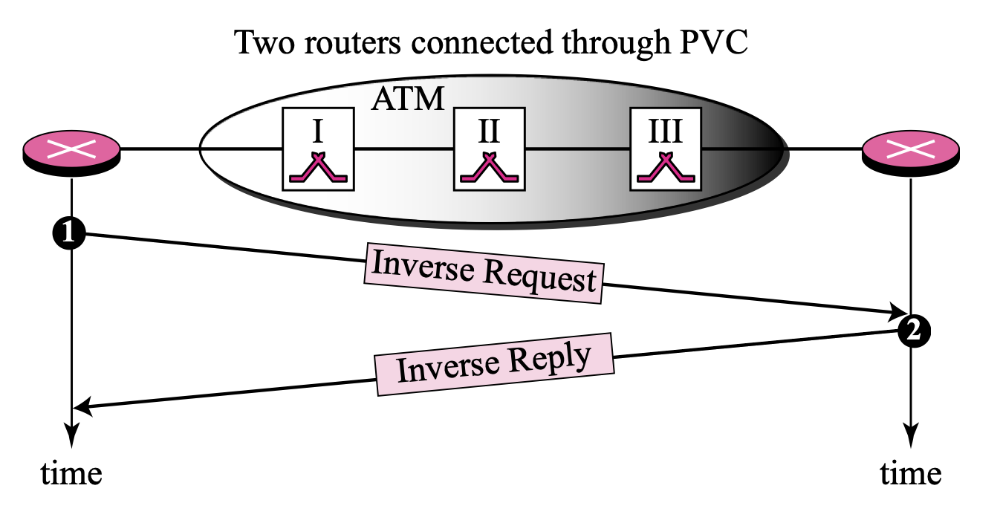

- Inverse ARP: PVC가 이미 연결돼 있으므로, 이 회선이 **어느 IP ↔ 어느 ATM 주소**인지 매핑

### SVC

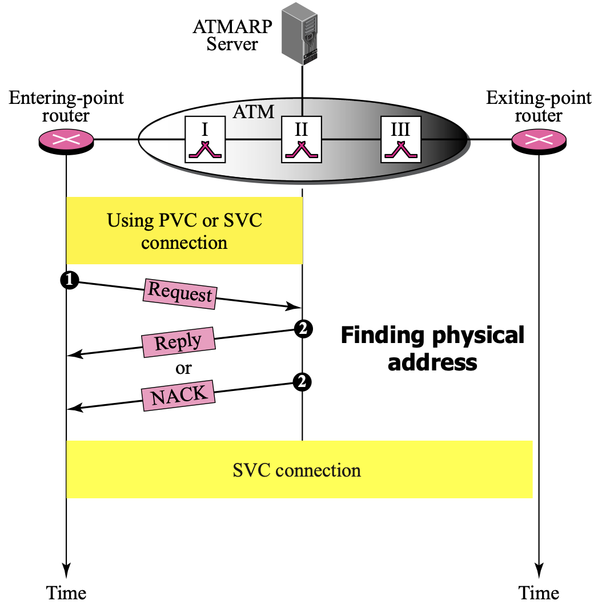

- 호스트가 서버에 IP 주소를 주고 ATM 주소 알려달라 요청(Request)
- 서버가 매핑 테이블에서 찾아서 Reply
- 동시에 서버도 Inverse ARP를 이용해 자기 매핑 테이블 업데이트

### LIS

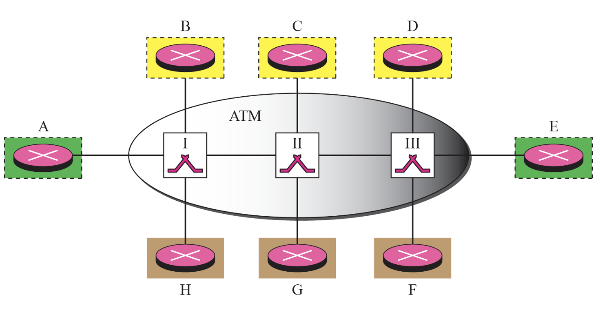

- ATM 네트워크를 여러 개의 Logical IP Subnet(LIS)로 분할
- 각 LIS는 자체 ATMARP 서버를 가져야 함
- 같은 LIS 안에서는 ATMARP로 직접 주소 매핑 후 통신
- 다른 LIS 간 통신은 반드시 라우터를 경유

## ARP Package

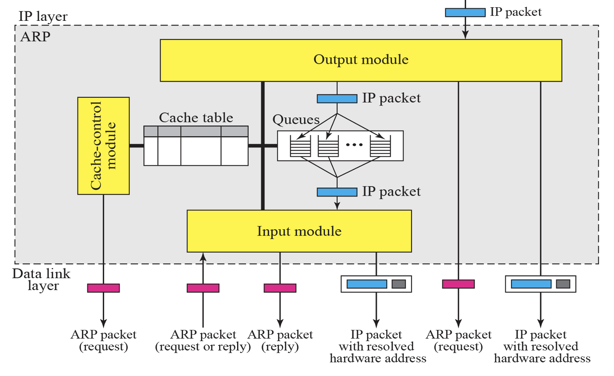

- Cache Table (ARP Cache)
    - IP ↔ MAC 주소 매핑을 저장하는 테이블
    - 각 엔트리는 상태(State)와 시간(Time-out)을 가짐
    - 상태 예시:
        - RESOLVED (R): 매핑 완료, MAC 주소 있음
        - PENDING (P): 요청 보냈지만 아직 응답 없음
        - FREE: 비어 있음 

- Queues
    - 목적지 MAC 주소를 아직 모를 때, 그 IP로 가야 할 패킷을 잠시 저장
    - ARP가 MAC 주소를 알아내면, 큐에 있던 패킷을 전송

- Output Module
    - IP 계층으로부터 패킷을 받아옴
    - 캐시를 확인
        - 있으면 → 바로 MAC 주소 넣어서 데이터링크 계층으로 보냄
        - 없으면 → 캐시에 “PENDING”으로 추가하고, ARP Request 전송 + 큐에 패킷 저장

- Input Module
    - 수신한 ARP 패킷(Request/Reply)을 처리
    - 캐시 업데이트 (PENDING → RESOLVED로 바꾸고, 시간 초기화)
    - 대기 큐에 있는 패킷들을 전송

- Cache-Control Module
    - 캐시 엔트리들의 타이머 관리
    - 일정 시간이 지나면 엔트리를 삭제하거나(PENDING 상태 오래되면 실패 처리) ICMP 에러를 상위 계층에 전달

