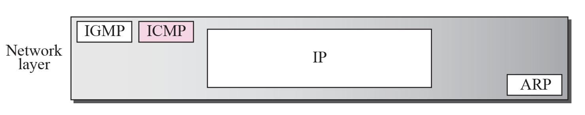
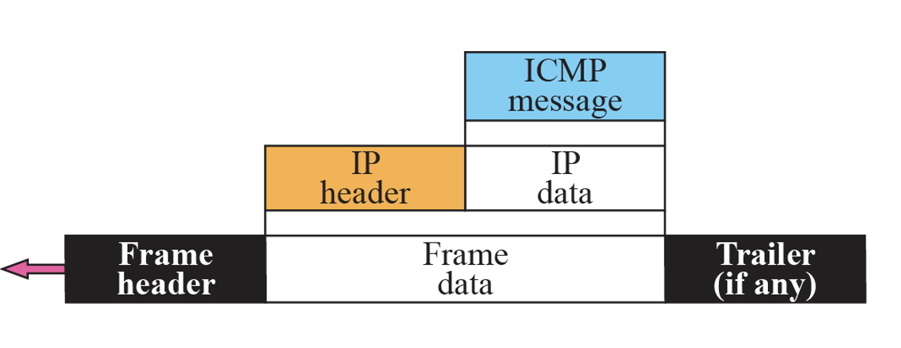
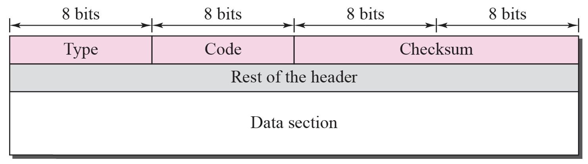
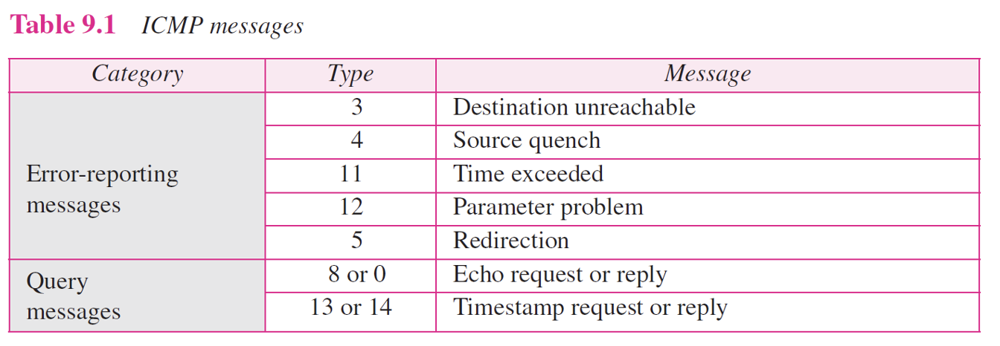
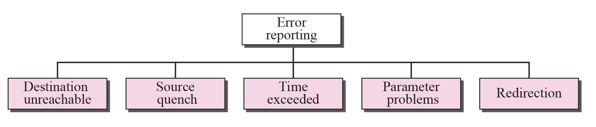
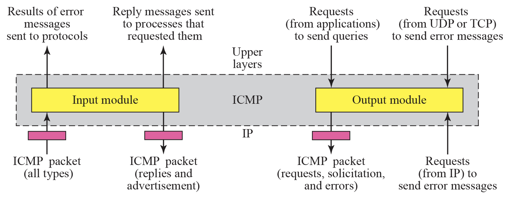

# TCP/IP
tcp/ip 복습

## ICMP
- ICMP는 왜 필요할까 ?
    - IP는 error-reporting, error-correcting 기능이 없음
    - 패킷이 제대로 전달됐는지 알 방법이 없음

- ICMP(Internet Control Message Protocol)
    - 네트워크 문제를 source에 알리는 역할(error-reporting)
    - 네트워크 상태를 확인(query)
    - IP payload 안에 캡슐화되어 같이 전송
    - IP Protocol 1번

 

- ICMP는 네트워크 계층에 속함
- 독립적으로 동작하는 것이 아닌, IP 패킷 안에서 캡슐화되어 전송
- 서비스용이 아닌 오류 보고용

  

<h3>[General format of ICMP messages]</h3>

- Error-reporting
    - Type 3: Destination unreachable
        - code 2, 3: destination host에 의해서만 발생 가능(라우터는 3계층까지만 활동하므로 만들 수 없음)
        - 그 외 코드는 라우터만 만듦

        | Code | 의미                              | 생성 주체                                |
        | ---- | ------------------------------- | ------------------------------------ |
        | 0    | Network unreachable             | 라우터                                  |
        | 1    | Host unreachable                | 라우터                                  |
        | 2    | Protocol unreachable            | **목적지 호스트** (IP까지는 도착했지만 상위 프로토콜 없음) |
        | 3    | Port unreachable                | **목적지 호스트** (해당 포트 닫힘)               |
        | 4    | Fragmentation needed but DF set | 라우터                                  |
        | 5    | Source route failed             | 라우터                                  |

     

    - Type 4: Source quench
        - flow controll 역할

    - Type 11: Time exceeded
        - packet을 버릴 때마다 발생
        - code 0: ttl이 만료됐음을 알림 (router만 발생시킴)
        - code 1: fragments 재조합 시간 초과 (host만 발생시킴)

    - Type 12: Parameter problem
        - IP 패킷 헤더에 잘못된 값이 들어 있어서 정상적으로 처리할 수 없을 때 생성되는 에러 메시지
        - code 0: 헤더 오류
        - code 1: 필수 옵션 빠짐

    - type 5: Redirection
        - host에게 최적의 네트워크 루트를 알려주는 기능
        - 다른 라우터에게 받은 redirection message이 더 효율적인 길이면 라우팅 테이블에 업데이트
        - local network 안에서만 보낼 수 있음

- Query
    - Type 8/0: Echo request/reply
        - 유지보수용, 적당한 data를 보냈을 때 그대로 돌아와야 함 (reachability)
        - ip protocol이 제대로 작동하는지 확인 (ex. ping)

    - Type 13/14: Timestamp request/reply
        - original timestamp: 처음 패킷을 보낸 시점
        - receive timestamp: 패킷 받은 시점 (처음 보낼 때 0)
        - transmit timestamp: reply할 때 시점 (처음 보낼 때 0)
        - transmit - original = 왕복 시간
        - 왕복시간 / 2 = 편도 시간 (송신자와 수신자간의 시간 동기화 가능)

## ICMP Package

- input/output 모듈로 나뉨

- input
    - ip로부터 protocol=1인 패킷을 받음
    - type, code 확인 후 에러 메세지인지 쿼리인지 확인
    - 에러인 경우 상위 계층에 전달
    - 쿼리인 경우 output 모듈에 응답 메세지 생성 요청

- output
    - 상위 계층으로부터 오류 발생했다는 보고를 받으면 ICMP Message 생성
    - Input 모듈이 echo request 받으면 reply 생성
