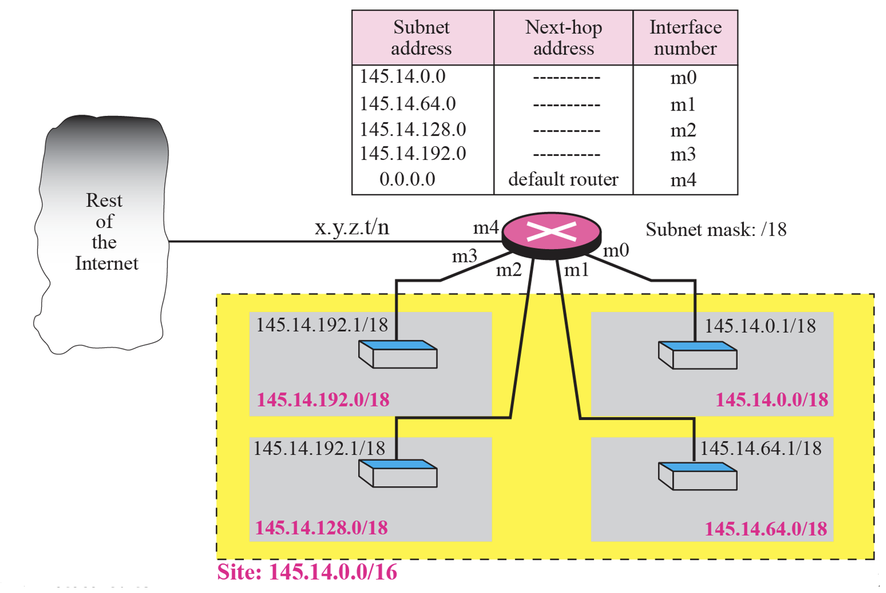

# TCP/IP
chap 06

## Delivery
- Direct Delivery: 송신자와 수신자가 같은 네트워크 안에 있을 때 직접 전달
- Indirect Delivery: 송신자와 수신자가 다른 네트워크에 있을 때 라우터를 거쳐 전달
 

## Forwarding
- 포워딩이란?  
    + 도착한 패킷을 목적지로 가는 경로상(next hop)으로 보내는 일을 말한다.   

- 포워딩 방식
    - 목적지 주소 기반(Forwarding based on destination address)
    - 라벨 기반 포워딩(Forwarding based on label)
    

### 목적지 주소 기반 포워딩
- next-hop method  
    + 목적지 호스트가 다른 네트워크에 있을 때, 라우터가 최종 목적지까지 직접 가지 않고,  
    중간 경로의 다음 라우터(next hop router)에게 패킷을 넘기는 방식  

    
     
    
      

- Network-specific method
    + 호스트가 아닌 네트워크 전체를 대상으로 하는 방법 
    + 테이블 크기 절감, 빠른 포워딩 등의 장점 

    
      

- Host-specific
    + 하나의 호스트에만 적용되는 구체적인 경로 (긴 prefix) 
    + 특정 서버만 우회/고정 경로로 보낼 때, 디버그 정책 용도 등으로 사용 

    
      

- Default routing
    + 라우팅 테이블에서 어떤 엔트리에도 매칭되지 않는 경우 마지막으로 선택되는 경로
    + prefix의 길이가 0이므로  모든 주소와 매칭되지만, Longest Prefix Match 규칙에서 가장 덜 구체적이므로 항상 최후의 선택지가 됨  

    
      

- Simplied forwarding module in classful address without subnetting
      
    
     

    1. 도착지 주소 확인
    2. A, B, C 중 어느 클래스에 속하는지 확인
    3. 네트워크 주소 추출
    4. 테이블 탐색
    5. 존재하면 포워딩, 없으면 디폴트
      

    **[figure 6.1]**

    

      

- ex 6.1  
Figure 6.8 shows an imaginary part of the Internet. Show the routing tables for router R1.
      

    **class A**

    | Network address | Next-hop address | Interface |
    |:---------------:|:----------------:|:---------:|
    | 111.0.0.0/8     | ---              | m0        |

     

    **class B**

    | Network address | Next-hop address | Interface |
    |:---------------:|:----------------:|:---------:|
    | 145.80.0.0/16   | ---              | m1        |
    | 170.14.0.0/16   | ---              | m2        |

     

    **class C**

    | Network address | Next-hop address | Interface |
    |:---------------:|:----------------:|:---------:|
    | 192.16.7.0/24   | 111.15.17.32     | m0        |
    
      

- ex 6.2  
Router R1 in Figure 6.8 receives a packet with destination address 192.16.7.14. Show how the packet is forwarded.  
-> **class C**

    | Network address | Next-hop address | Interface |
    |:---------------:|:----------------:|:---------:|
    | 192.16.7.0/24   | 111.15.17.32     | m0        |

      

- ex 6.3  
Router R1 in Figure 6.8 receives a packet with destination address 167.24.160.5. Show how the packet is forwarded.  
-> **Default**

    | Network address | Next-hop address | Interface |
    |:---------------:|:----------------:|:---------:|
    | 167.24.0.0      | 111.30.31.18     | m0        |

**[figure 6.11]**

  
Figure 6.11 shows a router connected to four subnets. Note several points. 
  
> First, the site address is 145.14.0.0/16 (a class B address). Every packet with destination address in the range 145.14.0.0 to 145.14.255.255 is delivered to the interface m4 and distributed to the final destination subnet by the router.
- 사이트에 할당된 주소 블록은 145.14.0.0/16 (class B)
- 목적지 주소가 145.14.0.0 ~ 145.14.255.255에 속하면, 라우터는 패킷을 m4 인터페이스로 보낸 뒤, 최종 목적지 서브넷으로 분배

 

> Second, we have used the address x.y.z.t/n for the interface m4 because we do not know to which network this router is connected.
- m4 인터페이스가 어디와 연결되어 있는지 모르기 때문에 x.y.z.t/n 형태로 표기

 

> Third, the table has a default entry for packets that are to be sent out of the site. The router is configured to apply the subnet mask /18 to any destination address.
- 라우팅 테이블에는 사이트 내부범위(/16) 이 맞지 않으면 사이트 밖으로 내보내는 default entry가 있음
- 라우터는 들어오는 모든 목적지 주소를 /18 로 나누어 적용

 

    145.14.0.0/16 -> 145.14.0.0/18
    subnet 1: 145.14.0.0/18 ~ 145.14.63.255/18
    subnet 2: 145.14.64.0/18 ~ 145.14.127.255/18
    subnet 3: 145.14.128.0/18 ~ 145.14.191.255/18
    subnet 4: 145.14.192.0/18 ~ 145.14.254.255/18

- ex 6.5  
The router in Figure 6.11 receives a packet with destination address 145.14.32.78. Show how the packet is forwarded.
