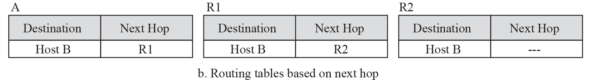
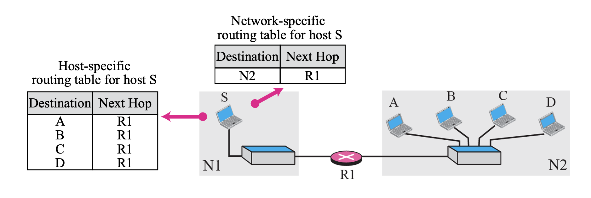
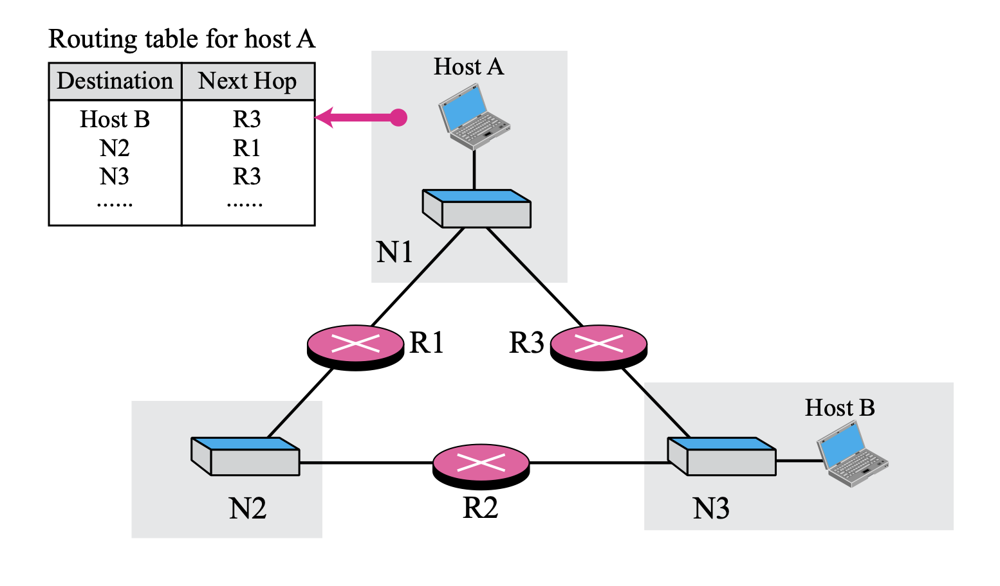

# TCP/IP
chap 06

## Delivery
- Direct Delivery: 송신자와 수신자가 같은 네트워크 안에 있을 때 직접 전달
- Indirect Delivery: 송신자와 수신자가 다른 네트워크에 있을 때 라우터를 거쳐 전달
 

## Forwarding
- 포워딩이란?  
    + 도착한 패킷을 목적지로 가는 경로상(next hop)으로 보내는 일을 말한다.   

- 포워딩 방식
    - 목적지 주소 기반(Forwarding based on destination address)
    - 라벨 기반 포워딩(Forwarding based on label)
    

### 목적지 주소 기반 포워딩
- next-hop method  
    + 목적지 호스트가 다른 네트워크에 있을 때, 라우터가 최종 목적지까지 직접 가지 않고,  
    중간 경로의 다음 라우터(next hop router)에게 패킷을 넘기는 방식  

    
     
    
      

- Network-specific method
    + 호스트가 아닌 네트워크 전체를 대상으로 하는 방법 
    + 테이블 크기 절감, 빠른 포워딩 등의 장점 

    
      

- Host-specific
    + 하나의 호스트에만 적용되는 구체적인 경로 (긴 prefix) 
    + 특정 서버만 우회/고정 경로로 보낼 때, 디버그 정책 용도 등으로 사용 

    
      

- Default routing
    + 라우팅 테이블에서 어떤 엔트리에도 매칭되지 않는 경우 마지막으로 선택되는 경로
    + prefix의 길이가 0이므로  모든 주소와 매칭되지만, Longest Prefix Match 규칙에서 가장 덜 구체적이므로 항상 최후의 선택지가 됨  

    
      

- Simplied forwarding module in classful address without subnetting
      
    
     

    1. 도착지 주소 확인
    2. A, B, C 중 어느 클래스에 속하는지 확인
    3. 네트워크 주소 추출
    4. 테이블 탐색
    5. 존재하면 포워딩, 없으면 디폴트
      

